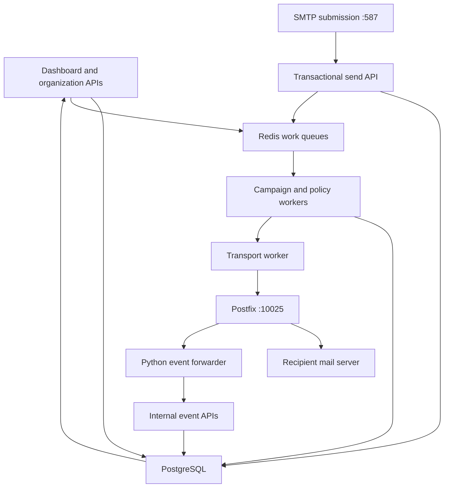

# NexiMail archived backend: architecture, flow and compatibility review

Source: `neximail-FULL-SOURCE-20260916-104536.tar.gz`, supplied by the owner in this conversation. Compared against GitHub `manshu145/Mail` at `f7ea350a8fa0e20a04831ca781c1308e1b558bd1`, with the transport safety changes in PR #3 considered separately.

This is a static source review of the backend execution paths, schema/migration registration, deployment wiring and important API contracts. It is not evidence that the archived code was deployed, that its production database contains all referenced tables, or that external provider integrations currently work. Archive paths below refer to that supplied archive, not to the current repository layout. Backups and the nested release archive were not treated as active runtime code.

## Main conclusion

**The archive and current GitHub project are materially different implementations. The current project is not a verified drop-in upgrade of this archive. Do not apply its migrations to the archived production database or replace that deployment on the strength of a green CI run.**

The archive is a multi-organization application with membership/trial authorization, PostgreSQL records, Redis work queues, a separate SMTP submission service, an adaptive campaign scheduler, application-level DKIM signing, Postfix delivery, and a Python event forwarder. The current repository uses a simpler global account model, database-polling workers and a different schema and API surface. Some capabilities are counterparts, some are absent, and some have different meanings.

## 1. Runtime topology

`docker-compose.yml`, `Dockerfile`, and `docker-entrypoint.sh` identify the real entrypoints. The app is bound on host loopback port 3200 to container 3000. Public SMTP submission uses 587; public port 25 accepts bounce recipients. Internal Postfix submission is 10025. Persistent volumes cover PostgreSQL, Redis, imports, media, Postfix spool and logs.

Compose runs app, policy, transport, campaign, contact import, bulk contact, reputation, webhook, Gmail validation and preflight processes, plus SMTP submission, Postfix, PostgreSQL and Redis. The policy service actually bundles `worker/index.ts`; `worker/policy.ts` is a shared evaluator imported by campaign code, not the policy service entrypoint. This distinction matters when changing policy.

## 2. Authentication and ownership

`lib/auth/session.ts` creates a random session token, stores its hash in PostgreSQL, signs the browser cookie and checks the active user on requests. Sessions expire after seven days; there is no sliding renewal in this implementation. Cookies are always marked Secure, so plain-HTTP local access is not equivalent to a production HTTPS session.

`lib/auth/guard.ts` loads organization membership from the database. Roles include owner, admin, member and trial; expired trials are rejected. Campaign endpoints additionally use `lib/auth/trial-campaign.ts` for assigned-campaign restrictions. Mutation routes commonly check trusted origin through `lib/auth/csrf.ts`. Transactional sending instead uses scoped API keys.

Core ownership chains include organization → memberships/contacts/domains/senders/campaigns; campaign → campaign recipients → message → delivery attempts/tracking events. Suppressions are organization + email scoped. The current repository's global contacts/suppressions and owner/admin/operator roles cannot represent these relationships without an explicit migration design.

## 3. Import → contacts → validation

1. `app/api/orgs/[orgId]/contacts/import/route.ts` checks owner/admin access and origin, parses import metadata, creates an uploading job and streams CSV bytes to `/data/imports/<job>.csv`.
2. Once upload finishes it marks the job queued and pushes its ID to `neximail:contact-import:queue`.
3. `worker/contact-import.ts` counts physical lines, maps aliases/custom fields, normalizes addresses and processes batches of 100. It checks syntax, known typo/disposable domains, role names and MX through `lib/validation/email.ts`.
4. It upserts organization-scoped contacts, import membership, tags and optional list membership. Existing suppressed contact status is retained. Syntax/MX-valid, unsuppressed rows become confirmed with the supplied consent source and a recorded import-time consent timestamp.
5. Completed jobs store counters/report samples, clear the source path and remove the CSV. Startup recovery requeues queued/processing jobs, but restarts processing from the beginning.
6. `worker/gmail-validation.ts` separately consumes `neximail:gmail-validation:queue`, uses the organization's encrypted SuperSend key, caches results, runs concurrent checks, and pauses/stops on job state or provider errors. This is an external-provider workflow, not the current repository's direct Gmail RCPT classification.

A syntax/MX result called `valid` is not proof that a mailbox exists. Imported consent metadata is recorded user input, not proof generated by the email checker.

## 4. Audience → preflight → campaign release

`lib/audience/query.ts` resolves organization-scoped lists, saved segments, tags, quick filters and include/exclude conditions. `worker/preflight.ts` scans that audience in batches of 500, checks suppression/contact confirmation/validation and writes per-contact membership decisions. Safe mode allows valid results; balanced mode can include unknown; manual mode ends in review_required.

The launch route checks owner/admin/trial assignment and, when required, a completed nonempty preflight bound to the same organization and campaign. It queues a launch signal and updates scheduling state.

`worker/campaign.ts` consumes launch signals and polls active campaigns. `campaign_adaptive_state` carries the audience cursor, release totals, hourly target, next release time, pause time and exhaustion state. Health windows adjust pacing. The worker reads the next recipient, checks preflight membership and delivery policy, renders standard/custom template tokens, inserts a message and campaign-recipient association, and pushes the message to `neximail:delivery:queue`.

The archived campaign is incrementally released, not a full one-shot audience snapshot. Temporary capacity failures leave the recipient queued without advancing the cursor. Permanent policy failures are skipped. Audience exhaustion leads to draining and eventual finalization.

## 5. Policy → transport → Postfix

`worker/index.ts` consumes the delivery queue and checks organization, reputation suspension, domain ownership/authentication/return path, platform approval, sending stream, suppression and marketing consent. Approved messages become ready_for_transport and enter `neximail:transport:queue`.

`worker/transport.ts` loads message/sender/domain/DKIM data, checks campaign/provider gates, acquires a Redis per-second slot and records sending state. Nodemailer signs with the decrypted domain DKIM key and submits to internal Postfix. Messages use a signed VERP bounce address and a stable message ID. Marketing adds tracking and unsubscribe headers.

Local SMTP acceptance becomes mta_accepted; it does not establish remote delivery or inbox placement. Postfix then performs remote delivery and owns retries for messages already in its queue. The application avoids resubmitting messages marked POSTFIX_QUEUE. Transport-level failures use a Redis retry sorted set and configurable backoff; provider cooldown logic can hold and probe selected providers.

The archive also has global-JFE gate code alongside provider-specific behavior. These paths must be tested together before assuming a cooldown only affects one provider.

## 6. Delivery events → suppressions → reports

`mta-event-forwarder.py` maps Postfix queue IDs to application message IDs using Message-ID/return path, tails logs and calls `app/api/internal/mta-event/route.ts` with a shared secret. It also inspects Postfix queues and manages hold/release/probe state persisted in the spool volume.

Remote sent maps to delivered, remote deferred remains pending under Postfix, and bounced updates attempts/message/recipient and inserts suppression. Separate internal bounce and complaint routes handle DSN/ARF feedback. Provider recovery state can affect subsequent release.

`app/t/open/route.ts` and `app/t/click/route.ts` record engagement. `app/api/unsubscribe/route.ts` verifies a signed token and updates both contacts and suppressions. `lib/reporting/delivery-stats.ts` aggregates campaign-recipient/message states and unique message-level open/click counts. `lib/campaigns/lifecycle.ts` requires audience exhaustion before completion, but excludes unresolved mta_accepted records older than 30 minutes from actionable work. Thus completed does not mean every final delivery outcome is known.

`worker/reputation.ts` computes reputation snapshots and guard state. Webhook events/deliveries are persisted and `worker/webhook.ts` posts signed payloads with backoff and five-attempt exhaustion.

## 7. Confirmed issues and concrete risks

| Priority | Evidence in archive | Impact and correction |
|---|---|---|
| Blocker | `lib/db/migrations/meta/_journal.json` registers only 0000–0007; 11 additional SQL files are outside it. `lib/db/migrate.ts` uses the Drizzle journal runner. | A clean standard migration run does not apply those later SQL files. Reconcile a complete ordered migration history against a restored database before deployment. Merely adding filenames with old timestamps can also be skipped by existing migration history. |
| Critical | Import route accepts a caller-provided job UUID; on an insert failure its catch updates that UUID without organization ownership and unlinks the derived source path. `targetListId` is also not checked against organization ownership in this route. | A known foreign job ID can target another job/file through the error path; a foreign list ID can cross tenant boundaries. Generate IDs server-side or validate ownership, record successful allocation, and clean up only resources created by this request. Validate list ownership. |
| High | Campaign message insert, recipient insert, Redis push and cursor update are separate operations. Transactional send similarly inserts DB then pushes Redis. Policy worker pops Redis without an acknowledgement protocol. | Failures between steps can strand records, lose work signals or create orphan messages. Use a transactional outbox plus idempotent DB claims and periodic reconciliation. Redis availability must not be the only proof of pending work. |
| High | Transport reads eligible state then unconditionally updates sending; acceptance and later DB persistence share one catch path. | Multiple consumers/recovery can race; ambiguous SMTP outcomes or post-acceptance DB errors need reconciliation instead of blind retry. Use atomic claim/lease and distinguish pre-DATA rejection from uncertain acceptance. |
| High | `worker/preflight.ts` ignores jobs already running and has no startup recovery scan. | Crash after running leaves a job stuck. Add durable cursor/lease and recover interrupted jobs. |
| High | Gmail-validation startup recovery pushes `{jobId, contactIds: []}`; selected scope resolution only uses selected contacts when the supplied array is nonempty. | An interrupted selected job loses its original selection and falls through to the unvalidated-contacts query. Persist job membership instead of keeping it only in a Redis payload. |
| High | Event forwarder calls process_line then saves the new log offset regardless of HTTP delivery success. | A failed terminal event can be checkpointed past; a final message may already have left Postfix, so queue scanning cannot guarantee reconstruction. Persist unacknowledged events or advance the offset only after acknowledgement. |
| High | MTA event route handles JFE before the terminal-state guard; other state changes use previously read status. | A replayed JFE response can move a terminal record back to deferred. Put idempotency and allowed-transition checks inside the write transaction, with unique event identity. |
| High | All non-JFE bounced events insert hard_bounce; conflict updates overwrite the previous reason. | Content/policy rejection can suppress a valid recipient and overwrite complaint/unsubscribe evidence. Classify recipient permanence separately and preserve stronger suppression reasons. |
| High | Marketing List-Unsubscribe points to `/unsubscribe?token=...`, while its POST handler is `/api/unsubscribe`. | The advertised one-click URL has a page rather than the matching POST handler. Point the header at the signed POST endpoint; keep the page URL for human interaction. |
| High | Current GitHub preflight/policy paths exclude invalid/suppressed contacts but do not enforce the archive's confirmed-consent gate. | Storing consent fields does not enforce sending policy. Restore a shared marketing eligibility check at preflight, queue promotion and final transport submission. The continuation of PR #3 restores confirmed consent plus a nonblank source in audience selection, queue promotion and final transport submission; it does not manufacture consent timestamps. |
| Medium | CSV importer parses one physical line at a time; counters restart at zero after recovery; contact upsert and job associations are not one batch transaction. | Quoted multiline CSV breaks, replay changes created/updated accounting, and partial batches can diverge. Use a real streaming CSV parser plus transactional checkpoints. |
| Medium | SMTP submission only parses simple headers/body; cumulative DATA buffer is not limited by its pending-line buffer cap, and recipients are submitted one at a time. | Multipart/encoded messages can be mangled, the advertised size cap is incomplete, and partial recipient acceptance can produce retries/duplicates. Use a maintained SMTP/MIME implementation with explicit size, timeout and idempotency handling. |
| Medium | Webhook creation only requires HTTPS; delivery fetch follows redirects without a private-address/redirect policy. | Organization admins can aim requests at reachable internal HTTPS services. Validate destinations and redirects and bound response reads. |
| Medium | Tracking click destination is a separate unsigned URL; redirection occurs even when the message token is invalid. | Links can be repurposed as an open redirect and the tracked destination can be altered. Sign destination + message identity together and reject invalid tokens before redirecting. |

The archive also duplicates policy logic in `worker/index.ts`, `worker/policy.ts` and `lib/delivery/policy.ts`. Their checks differ. Hour/day counts are read in the latter evaluators although comments explicitly disable those as admission ceilings; this is both a semantic difference from the current hard-limit model and avoidable query cost. It must be resolved deliberately rather than reintroducing limits accidentally.

## 8. Compatibility map to current GitHub

| Area | Archived behavior | Current repo / migration consequence |
|---|---|---|
| Tenancy/auth | Organization memberships, expiring trial assignments, DB-backed opaque sessions | Global owner/admin/operator model, 12-hour JWT sessions; explicit identity/tenant mapping needed |
| Queue | Redis lists, seen sets, retry sorted set, DB records | Database-polling claim workers; not an in-place queue rename |
| Transactional sending | `/api/v1/send` and SMTP AUTH/STARTTLS submission | No corresponding send route or submission service found in inspected current route/service surface |
| Campaign release | Cursor-based adaptive release with hourly health windows | Whole eligible audience snapshot in chunks, account/delivery limits |
| Preflight | Job, mode, campaign binding and per-contact membership | Aggregate campaign preflight and eligible-recipient resolution |
| Validation | Syntax/MX checks plus SuperSend Gmail provider | Different validation worker and RCPT accepted/unknown semantics |
| Contacts | Dedicated profile columns, custom_fields, organization+email identity | Global normalized email identity and attributes JSON; conversion needed |
| Consent | Confirmed + source + timestamp required for marketing | Base revision lacked enforcement; PR #3 restores confirmation/source checks without inventing consent |
| Domain/DKIM | Organization ownership, approval and application signing | Different sending-domain/account schema and Postfix setup |
| Events/cooldowns | Python forwarder + internal APIs + held Postfix queues | TypeScript Postfix event worker, different event routes and cooldown records |
| Reporting | Campaign-recipient join, unresolved historical acceptance | Different message/event aggregates and terminal-state semantics |

## 9. Work completed and next implementation order

PR #3 changes the current repository only: SMTP close handling, uncertain-acceptance retry protection, runtime send-disable enforcement, final recipient/suppression checks, preservation of paused unsent messages, guarded bulk/individual retries visible UI action errors, and explicit marketing-consent enforcement. These are useful fixes but do not implement the compatibility map above and do not modify the uploaded archive.

Recommended implementation order:

1. Preserve this archive as the production-behavior reference. Inventory a restored database's actual migration history and schema before writing an upgrade path.
2. Close organization boundary gaps and recoverable job membership, and verify restored consent enforcement before any live rollout.
3. Unify message state transitions, durable queue ownership and event acknowledgement; test crash/restart boundaries.
4. Implement explicit parity for transactional SMTP/API, trial access, adaptive release and preflight modes where those archived features remain required.
5. Map data without losing IDs, consent history, suppressions, recipients, attempts or tracking tokens. Rehearse on a restored copy and compare row counts and representative histories.
6. Run an end-to-end isolated environment: import → validation → preflight → launch → controlled SMTP recipient → event reconciliation → reports → unsubscribe → retry exclusion. Add restart, duplicate-event and pause/resume cases.
7. Only after those pass, prepare a reversible deployment with verified backups, schema compatibility and worker cutover. Production VPS/database behavior has not been verified in this review.

Decision: **not ready to replace the archived production system with the current repository.** The architecture and critical paths are mapped; compatibility and runtime validation remain real work, not assumed completion.

## Implementation rule from the owner

The archive is a reference for intended product behavior, not a code template. Do not port its bugs, duplicate policy implementations, obsolete workarounds, unsafe retry logic or broken migration history. Reimplement a required behavior in the current architecture only after identifying its inputs, outputs, permissions, state transitions and regression cases. A capability in the parity table is an item to evaluate, not automatic approval to transplant its old implementation.
